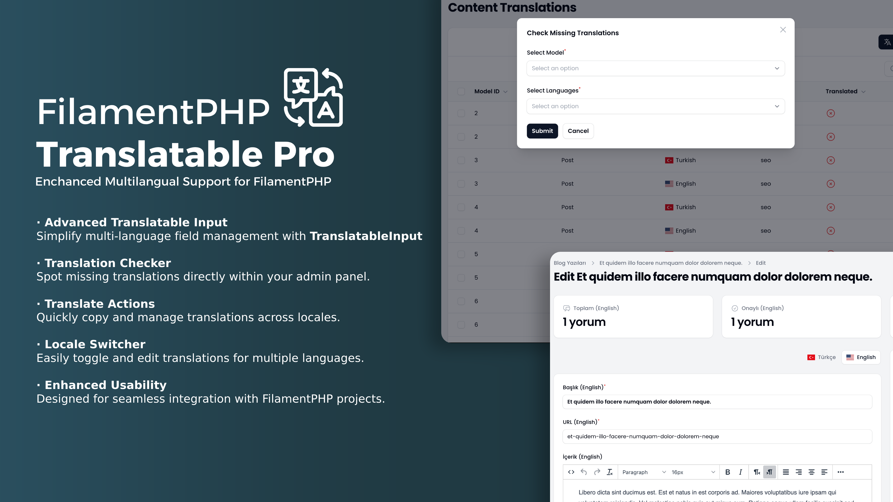
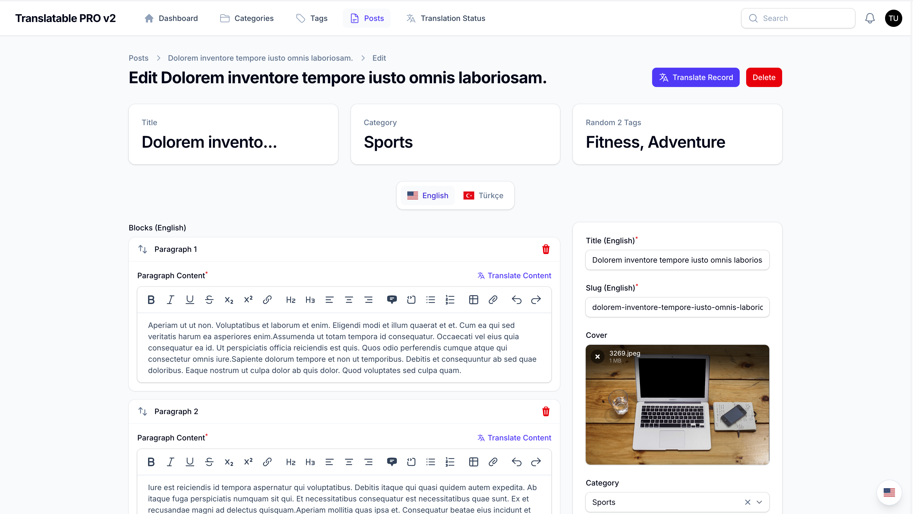

# Filament Translatable Pro

[](https://packagist.org/packages/afsakar/filament-translatable-pro)
[](https://github.com/afsakar/filament-translatable-pro/actions?query=workflow%3Arun-tests+branch%3Amain)
[](https://github.com/afsakar/filament-translatable-pro/actions?query=workflow%3A"Fix+PHP+code+styling"+branch%3Amain)
[](https://packagist.org/packages/afsakar/filament-translatable-pro)

<center>

</center>

## Table of Contents

- [Introduction](#introduction)
- [Features](#features)
- [Installation](#installation)
    - [Register the Plugin](#register-the-plugin)
- [Usage](#usage)
  - [Preparing Resources](#preparing-resources)
  - [Using TranslatableInput](#using-translatableinput)
  - [Specialized Use Cases](#specialized-use-cases)
- [Actions](#actions)
    - [TranslateAndCopyAction](#translateandcopyaction)
    - [TranslateFieldAction](#translatefieldaction)
- [Columns](#columns)
    - [TranslationProgressColumn](#translationprogresscolumn)

## Introduction

**Filament Translatable Pro** is a powerful FilamentPHP plugin that enhances the [Spatie Translatable package](https://spatie.be/docs/laravel-translatable/) with advanced, user-friendly features. It streamlines multi-language management in FilamentPHP projects, enabling developers to build immersive, multilingual applications with ease.



## Features

- `Translatable Input`: Simplifies multi-language management and localization within FilamentPHP projects.
- `Translate And Copy Action`: An action for copying main locale values to other locales.
- `Translate Field Action`: An action for translating a single field to other locales.
- `Locale Switcher`: A handy action to update all translatable fields for different locales in a single click, allowing you to switch table columns with translatable values.
- Auto detect translatable attributes from model.

## Installation

Install the package via Composer:

```bash
composer require afsakar/filament-translatable-pro
```

Next, add the plugin's views to your custom theme in your `tailwind.config.js` file:

> **Important**  
> If you haven’t set up a custom theme and are using a Panel, follow the instructions in the [Filament Docs](https://filamentphp.com/docs/3.x/panels/themes#creating-a-custom-theme) first. This setup applies to both the Panels and standalone Forms packages.

```js
content: [
    ...
    '<path-to-vendor>/afsakar/filament-translatable-pro/resources/**/*.blade.php',
]
```

Afterward, run `npm run build` or `yarn build` to compile assets.

Publish the configuration file if needed:

```bash
php artisan vendor:publish --tag="filament-translatable-pro-config"
```

In the published config file, you can define the available locales:

```php
return [
    'locales' => ['tr', 'en'],
];
```

Optionally, publish translations using:

```bash
php artisan vendor:publish --tag="filament-translatable-pro-translations"
```

### Register the Plugin

Register the plugin in your Filament service provider:

```php
class AdminPanelProvider extends PanelProvider
{
    public function panel(Panel $panel): Panel
    {
        return $panel
            ->plugins([
                \Afsakar\FilamentTranslatablePro\FilamentTranslatableProPlugin::make()
                    ->locales([
                        'tr' => 'Türkçe',
                        'en' => 'English'
                    ])
                    ->globalSwitcher(false) // You can disable the global switcher
                    ->renderHook(PanelsRenderHook::TOPBAR_START)
                    ->suffixLocale(true) // Add suffix locale label globally
                    ->prefixLocale(true) // Add prefix locale label globally
            ]);
    }
}
```

## Usage

### Preparing Resources

To prepare your resources for translatable fields, add the `Translatable` trait in your Filament Resources:

```php
<?php

namespace App\Filament\Resources;
use Afsakar\FilamentTranslatablePro\Resources\Concerns\Translatable;
use Filament\Resources\Resource;

class PostResource extends Resource
{
    use Translatable;
    // resource code
}
```

Add the `Translatable` trait to your List Page as well:

```php
<?php

namespace App\Filament\Resources\PostResource\Pages;

use Afsakar\FilamentTranslatablePro\Resources\Pages\ListRecords\Concerns\Translatable;
use App\Filament\Resources\PostResource;
use Filament\Resources\Pages\ListRecords;

class ListPosts extends ListRecords
{
    use Translatable;

    protected static string $resource = PostResource::class;
}
```

Edit Page;

```php
<?php

namespace App\Filament\Resources\PostResource\Pages;

use Afsakar\FilamentTranslatablePro\Actions\TranslateAndCopyAction;
use Afsakar\FilamentTranslatablePro\Resources\Pages\EditRecords\Concerns\Translatable;
use App\Filament\Resources\PostResource;
use Filament\Resources\Pages\ListRecords;

class EditPosts extends ListRecords
{
    use Translatable;

    protected static string $resource = PostResource::class;

    protected function getHeaderActions(): array
    {
        return [
            TranslateAndCopyAction::make(),
            Actions\DeleteAction::make(),
        ];
    }

    // You can use Translatable in widgets as well
    protected function getHeaderWidgets(): array
    {
        return [
            PostResource\Widgets\PostCommentsWidget::make([
                'activeLocale' => $this->activeLocale, // You need to pass the active locale to the widget
            ]),
        ];
    }
}
```

PostCommentsWidget class;

```php
<?php

namespace App\Filament\Resources\PostResource\Widgets;

use Afsakar\FilamentTranslatablePro\Facades\FilamentTranslatablePro;
use Afsakar\FilamentTranslatablePro\Resources\Widgets\Concerns\Translatable;
use Filament\Widgets\StatsOverviewWidget as BaseWidget;

class PostCommentsWidget extends BaseWidget
{
    use Translatable;

    public ?Model $record = null;

    protected function getStats(): array
    {
        $locales = FilamentTranslatablePro::getLocales();

        return [
            BaseWidget\Stat::make('Total ('.FilamentTranslatablePro::getLocaleLabel($this->activeLocale).')', $this->record->comments->where('locale', $this->activeLocale)->count())
                ->icon('heroicon-o-chat-bubble-left-right'),
            BaseWidget\Stat::make('Published ('.FilamentTranslatablePro::getLocaleLabel($this->activeLocale).')', $this->record->comments->where('locale', $this->activeLocale)->whereNotNull('published_at')->count())
                ->icon('heroicon-o-check-circle'),
            BaseWidget\Stat::make('Unpublish ('.FilamentTranslatablePro::getLocaleLabel($this->activeLocale).')', $this->record->comments->where('locale', $this->activeLocale)->whereNull('published_at')->count())
                ->icon('heroicon-o-clock'),
        ];
    }
}
```


For resources with relationships, include the `Translatable` trait in the related Resource Form Page:

```php
<?php

namespace App\Filament\Resources\PostResource\RelationManagers;

use Afsakar\FilamentTranslatablePro\Resources\RelationManagers\Concerns\Translatable;
use Filament\Resources\RelationManagers\RelationManager;

class CategoriesRelationManager extends RelationManager
{
    use Translatable;

    protected static string $relationship = 'categories';
}
```


### Using TranslatableInput

The `TranslatableInput` component supports multi-language input fields in Filament forms:

```php
use Afsakar\FilamentTranslatablePro\Forms\Components\TranslatableInput;
use Filament\Forms;
use Filament\Actions\Action;

TranslatableInput::make()
    ->locales(['tr', 'en'])
    ->prefixLocale()
    ->suffixLocale()
    ->onlyMainLocaleRequired(force: true)
    ->onlyFlag(true)
    ->tabPosition('center')
    ->showTabs(false)
    ->actions([
        Action::make('fill_with_dump')
            ->action(function (array $arguments) {
                $locale = $arguments['locale'];
                // ...
            })
    ])
    ->exclude(['description'])
    ->schema(fn (string $locale) => [
        Forms\Components\TextInput::make('name')->required($locale === 'tr'),
        Forms\Components\Textarea::make('description')->required($locale === 'tr'),
    ]);
```

* `actions`: An array of actions to be added to the component.
* `exclude`: An array of fields to be excluded from the component.
* `onlyMainLocaleRequired`: Make only main locale required if component has required attribute. If force is true, make all components required for main locale.
* `onlyFlag`: Show only flag in the tab.
* `tabPosition`: Tab position. `start`, `center`, `end`. Default is `end`.
* `showTabs`: Show tabs. Default is `true`.

```php
use Afsakar\FilamentTranslatablePro\Forms\Components\TranslatableInput;
use Filament\Forms;

TranslatableInput::make()
    ->schema([
        Forms\Components\Section::make([
            Forms\Components\TextInput::make('title'),
            Forms\Components\Textarea::make('description'),
        ]),
    ]);
```


### Specialized Use Cases

Get the current locale of a component with `getMeta('locale')`:

```php
use Afsakar\FilamentTranslatablePro\Facades\FilamentTranslatablePro;
use Afsakar\FilamentTranslatablePro\Actions\TranslateFieldAction;
use Afsakar\FilamentTranslatablePro\Forms\Components\TranslatableInput;
use Filament\Forms;

public static function form(Form $form): Form
{
    return $form
        ->schema([
            TranslatableInput::make()
                ->suffixLocaleLabel()
                ->schema([
                    Forms\Components\Section::make('Title Section')
                        ->columnSpanFull()
                        ->columns()
                        ->schema([
                            Forms\Components\TextInput::make('title')
                                ->live(true)
                                ->hintAction(TranslateFieldAction::make())
                                ->afterStateUpdated(function ($state, $set, $context, $component) {
                                    if ($context === 'edit') {
                                        return;
                                    }
    
                                    $language = $component->getMeta('locale');
    
                                    $set('slug.' . $language, str($state)->slug());
                                })
                                ->required(),
                            Forms\Components\TextInput::make('slug')
                                ->dehydrateStateUsing(function ($state) {
                                    return str($state)->slug();
                                })->unique(ignoreRecord: true),
                        ]),
                    Forms\Components\Section::make()
                        ->schema([
                            Forms\Components\FileUpload::make('image')->lazy(),
                            Forms\Components\RichEditor::make('content')->hintAction(TranslateFieldAction::make()),
                            Forms\Components\Repeater::make('optional')
                                ->label('Optional')
                                ->addActionLabel(fn($component) => 'Add Optional (' . FilamentTranslatablePro::getLocaleLabel($component->getMeta('locale')) . ')')
                                ->schema([
                                    Forms\Components\TextInput::make('key'),
                                    Forms\Components\TextInput::make('value'),
                                ]),
                        ]),
                ]),
        ]);
}
```

## Actions

### TranslateAndCopyAction

The `TranslateAndCopyAction` allows you to copy the main locale values to other locales.


```php
<?php

namespace App\Filament\Resources\PostResource\Pages;

use Afsakar\FilamentTranslatablePro\Actions\TranslateAndCopyAction;
use App\Filament\Resources\PostResource;
use Filament\Actions;
use Filament\Resources\Pages\EditRecord;

class EditPost extends EditRecord
{
    protected static string $resource = PostResource::class;

    protected function getHeaderActions(): array
    {
        return [
            TranslateAndCopyAction::make()
                ->except(['slug']),
            Actions\DeleteAction::make(),
        ];
    }
}
```

### TranslateFieldAction

The `TranslateFieldAction` allows you to translate a single field to other locales. 


```php
use Afsakar\FilamentTranslatablePro\Actions\TranslateFieldAction;
use Afsakar\FilamentTranslatablePro\Forms\Components\TranslatableInput;
use Filament\Forms;

TranslatableInput::make([
    Forms\Components\Group::make(
        TranslatableInput::make([
            TinyEditor::make('content')->label('İçerik')->hintAction(TranslateAction::make()), // Add the TranslateAction to the hintAction
        ])->onlyMainLocaleRequired(),
    );
```

Note: The `TranslateFieldAction` action doesn't work with the `Repeater` component.

## Columns

### TranslationProgressColumn

The `TranslationProgressColumn` column displays the translation progress of a record. It's auto detect the translatable attributes from the model and calculate the progress for each locale.


## Contributing

See [CONTRIBUTING](.github/CONTRIBUTING.md) for details on how to contribute.

## Security Vulnerabilities

Please review [our security policy](../../security/policy) to report vulnerabilities.

## Credits

- [Azad Furkan ŞAKAR](https://github.com/afsakar)
- [All Contributors](../../contributors)

# Support

If you have a question, bug or feature request, please e-mail me at afsakarr@gmail.com or tag @afsakar on #afsakar-translatable-pro on the Filament Discord. Love to hear from you!
